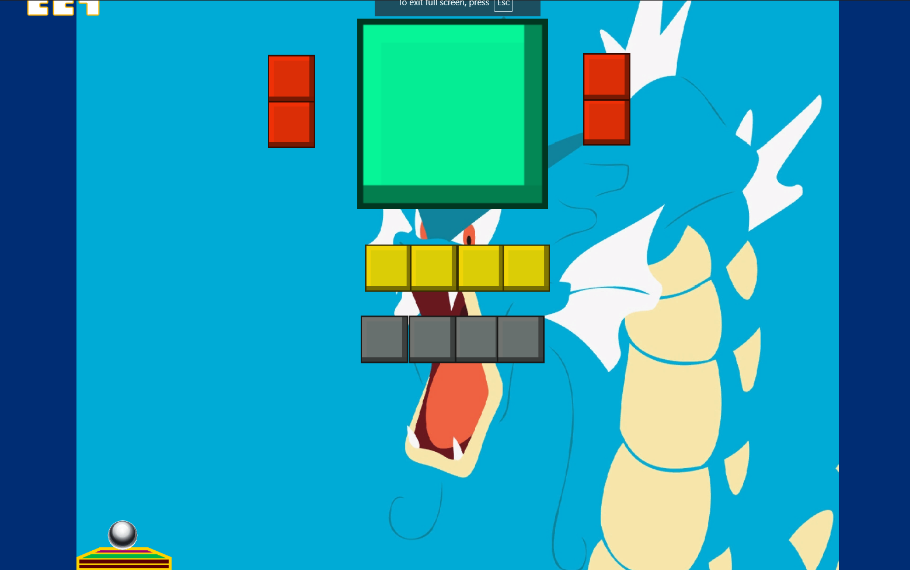

<h1 align="center">2D Game</h1>

Project <strong>Pokemon Block Breaker</strong> developed in 2020

  
  <a aria-label="Unity" href="https://github.com/facebook/react/blob/master/CHANGELOG.md#16120-november-14-2019">
    </img>
  </a>
  

<a href="https://sharemygame.com/@Savio/laser-defender-">
  </img>
</a>

## :rocket: Technologies

<table>
  <thead>
    <th>Back-end</th>
    <th>Front-end</th>
  </thead>
  <tbody>
    <tr>
      <td>C#</td>
      <td>Unity</td>
    </tr>
  </tbody>
</table>

